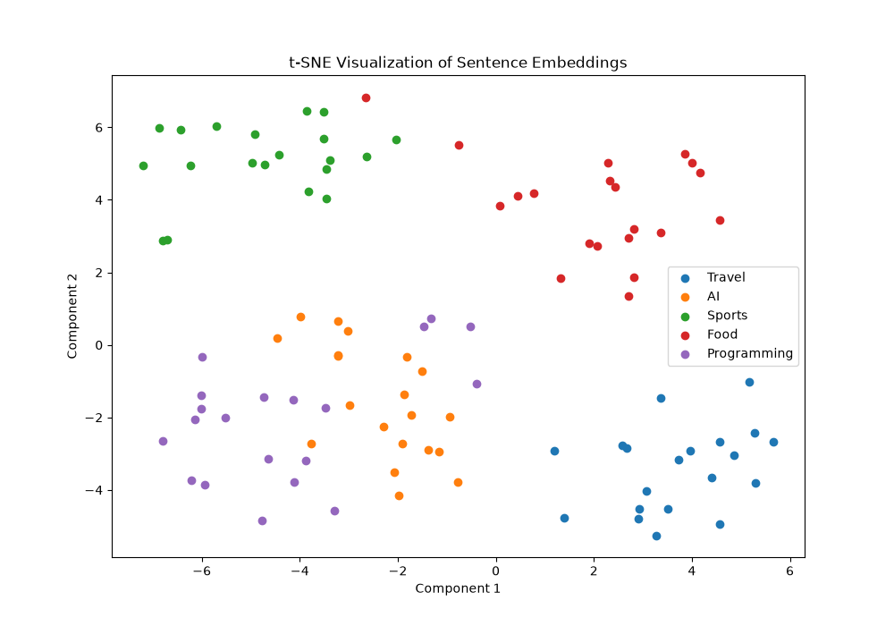

# Pinecone Document Search

Week 6 project from the AI Backend Playbook.

## Progress

- Day 21 ✅ Embeddings & Semantic Similarity
- Day 22 ⬜ Embedding Explorer
- Day 23 ⬜ Vector Database Comparison
- Day 24 ⬜ Document Ingestion into Pinecone
- Day 25 ⬜ Chunking Strategies

## Day 21

- Learned what embeddings are
- Generated multilingual embeddings locally
- Used `paraphrase-multilingual-MiniLM-L12-v2`
- Vector dimension: `384`
- Calculated cosine similarity
- Verified semantically similar sentences score higher
- Compared local and API-based embedding approaches

## Day 22 — Embedding Explorer

- Built a reproducible dataset with 100 sentences in 5 categories.
- Generated embeddings with two SentenceTransformer models.
- Both models produced vectors with 384 dimensions.
- Implemented cosine similarity search and compared Top 5 results.
- Reduced embeddings from 384D to 2D using t-SNE.
- t-SNE showed relatively clear clusters, with more overlap between AI and Programming.

## Day 23 — Vector DB Comparison

Compared Pinecone, Weaviate, and Milvus based on:
- ease of setup
- free tier
- scalability
- managed cloud support
- metadata filtering

### Decision

Pinecone was selected because it is simple to set up, provides a managed cloud service, supports vector similarity search well, and fits the current document search project.

### Pinecone Setup

- Created a Pinecone account
- Added API key through `.env`
- Added `.env` to `.gitignore`
- Created `document-search` index
- Vector dimension: `384`
- Similarity metric: `cosine`
- Verified successful connection to the index